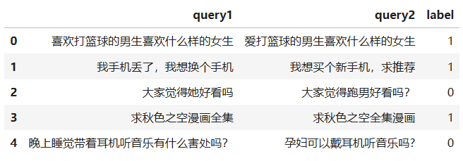

# llm-master
从零到一：成为LLM专家

## 课外拓展

### 1.文本匹配任务

- [从零到一:7步掌握文本匹配(实战版)-上](https://zhuanlan.zhihu.com/p/16378571586)
- 

[打卡 - 2024书生·浦语大模型实战营(第四期)基础Task1](https://zhuanlan.zhihu.com/p/16453620904)  
[打卡 - 2024书生·浦语大模型实战营(第四期)基础Task2](https://zhuanlan.zhihu.com/p/16464795721)  
[打卡 - 2024书生·浦语大模型实战营(第四期)基础Task3](https://zhuanlan.zhihu.com/p/16489434847)  
[打卡 - 2024书生·浦语大模型实战营(第四期)基础Task4](https://zhuanlan.zhihu.com/p/16519891579)  
[打卡 - 2024书生·浦语大模型实战营(第四期)基础Task5](https://zhuanlan.zhihu.com/p/16731666557)  
[打卡 - 2024书生·浦语大模型实战营(第四期)基础Task6](https://zhuanlan.zhihu.com/p/16757031989)  
